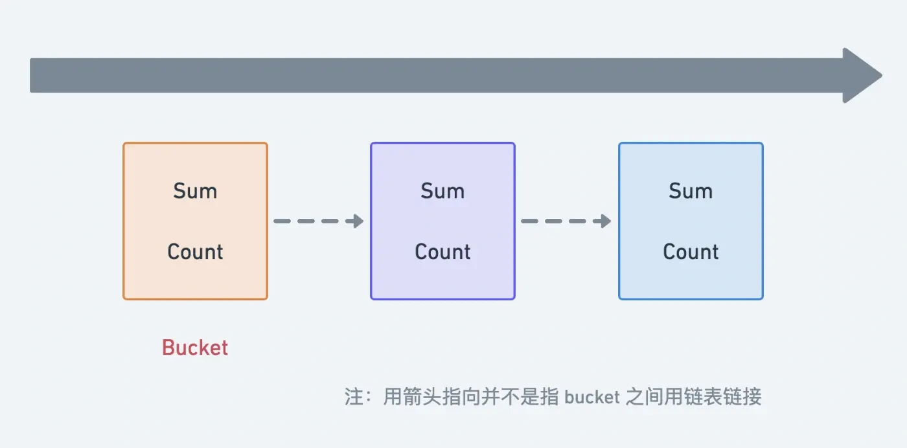
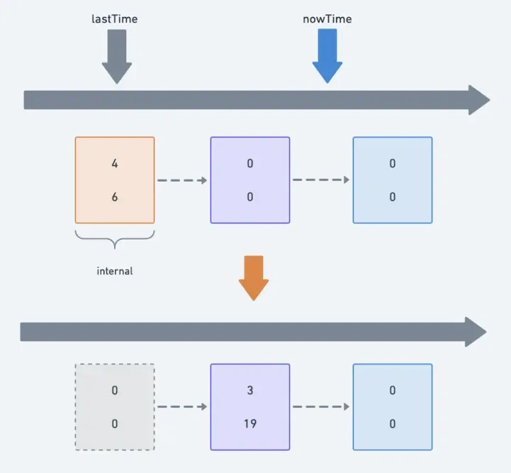
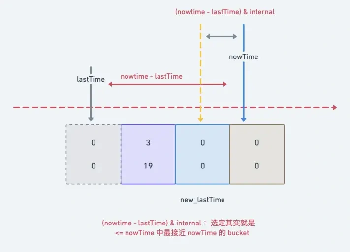

# 自适应微服务治理背后的算法

## 前言


> 服务监控是通过什么算法实现的？
>
> 滑动窗口是怎么工作的？能否讲讲这块的原理？
>
> 熔断算法是怎么设计的？为啥没有半开半闭状态呢？

本篇文章，来分析一下 `go-zero` 中指标统计背后的实现算法和逻辑。

## 指标怎么统计

这个我们直接看 `breaker` ：

```go
type googleBreaker struct {
  k     float64
  stat  *collection.RollingWindow
  proba *mathx.Proba
}
```

> `go-zero` 中默认的 `breaker` 是以 *google SRE* 做为实现蓝本。

当 `breaker` 在拦截请求过程中，会记录当前这类请求的成功/失败率：

```go
func (b *googleBreaker) doReq(req func() error, fallback func(err error) error, acceptable Acceptable) error {
  ...
  // 执行实际请求函数
  err := req()
  if acceptable(err) {
    // 实际执行：b.stat.Add(1)
    // 也就是说：内部指标统计成功+1
    b.markSuccess()
  } else {
    // 原理同上
    b.markFailure()
  }

  return err
}
```

所以其实底层说白了就是：**请求执行完毕，会根据错误发生次数，内部的统计数据结构会相应地加上统计值(可正可负)。同时随着时间迁移，统计值也需要随时间进化。**

简单来说：**时间序列内存数据库**【也没数据库这么猛，就是一个存储，只是一个内存版的】

下面就来说说这个时间序列用什么数据结构组织的。

## 滑动窗口

我们来看看 `rollingwindow` 定义数据结构：

```go
type RollingWindow struct {
    lock          sync.RWMutex
    size          int
    win           *window
    interval      time.Duration
    offset        int
    ignoreCurrent bool
    lastTime      time.Duration
  }
```

上述结构定义中，`window` 就存储指标记录属性。

在一个 `rollingwindow` 包含若干个桶（这个看开发者自己定义）：



每一个桶存储了：`Sum` 成功总数，`Count` 请求总数。所以在最后 `breaker` 做计算的时候，会将 Sum 累计加和为 `accepts`，Count 累计加和为 `total`，从而可以统计出当前的错误率。

### 滑动是怎么发生的

首先对于 `breaker` 它是需要统计单位时间（比如1s）内的请求状态，对应到上面的 `bucket` 我们只需要将单位时间的指标数据记录在这个 `bucket` 即可。

那我们怎么保证在时间前进过程中，指定的 `Bucket` 存储的就是单位时间内的数据？

第一个想到的方式：后台开一个定时器，每隔单位时间就创建一个 `bucket` ，然后当请求时当前的时间戳落在 `bucket` 中，记录当前的请求状态。周期性创建桶会存在临界条件，数据来了，桶还没建好的矛盾。

第二个方式是：惰性创建 `bucket`，当遇到一个数据再去检查并创建 `bucket`。这样就有时有桶有时没桶，而且会大量创建 `bucket`，我们是否可以复用呢？

go-zero 的方式是：`rollingwindow` 直接预先创建，请求的当前时间通过一个算法确定到`bucket` ，并记录请求状态。

下面看看 `breaker` 调用 `b.stat.Add(1)` 的过程：

```go
func (rw *RollingWindow) Add(v float64) {
  rw.lock.Lock()
  defer rw.lock.Unlock()
  // 滑动的动作发生在此
  rw.updateOffset()
  rw.win.add(rw.offset, v)
}

func (rw *RollingWindow) updateOffset() {
  span := rw.span()
  if span <= 0 {
    return
  }

  offset := rw.offset
  // 重置过期的 bucket
  for i := 0; i < span; i++ {
    rw.win.resetBucket((offset + i + 1) % rw.size)
  }

  rw.offset = (offset + span) % rw.size
  now := timex.Now()
  // 更新时间
  rw.lastTime = now - (now-rw.lastTime)%rw.interval
}

func (w *window) add(offset int, v float64) {
  // 往执行的 bucket 加入指定的指标
  w.buckets[offset%w.size].add(v)
}
```



上图就是在 `Add(delta)` 过程中发生的 `bucket` 发生的窗口变化。解释一下：

1. `updateOffset` 就是做 `bucket` 更新，以及确定当前时间落在哪个 `bucket` 上【超过桶个数直接返回桶个数】，将其之前的 `bucket` 重置
    - 确定当前时间相对于 `bucket interval`的跨度【超过桶个数直接返回桶个数】
    - 将跨度内的 `bucket` 都清空数据。`reset`
    - 更新 `offset`，也是即将要写入数据的 `bucket`
    - 更新执行时间 `lastTime`，也给下一次移动做一个标志
2. 由上一次更新的 `offset`，向对应的 `bucket` 写入数据

而在这个过程中，如何确定确定 `bucket` 过期点，以及更新时间。滑动窗口最重要的就是时间更新，下面用图来解释这个过程：



而  `bucket` 过期点，说白就是 `lastTime` 即上一个更新时间跨越了几个 `bucket`：`timex.Since(rw.lastTime) / rw.interval`

---

这样，在 `Add()` 的过程中，通过 `lastTime` 和 `nowTime` 的标注，通过不断重置来实现窗口滑动，新的数据不断补上，从而实现窗口计算。

## 总结

本文分析了 `go-zero` 框架中的指标统计的基础封装、滑动窗口的实现 `rollingWindow`。当然，除此之外，`store/redis` 也存在指标统计，这个里面的就不需要滑动窗口计数了，因为本身只需要计算命中率，命中则对 hit +1，不命中则对 miss +1 即可，分指标计数，最后统计一下就知道命中率。

滑动窗口适用于流控中对指标进行计算，同时也可以做到控流。


> 作者：kevwan
> 链接：https://learnku.com/articles/57171
> 来源：learnku
> 著作权归作者所有。商业转载请联系作者获得授权，非商业转载请注明出处。