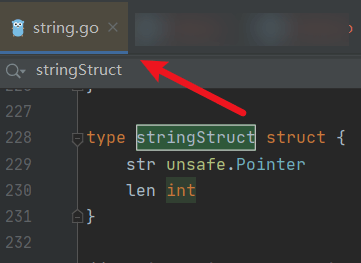
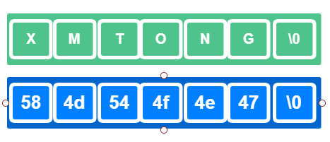
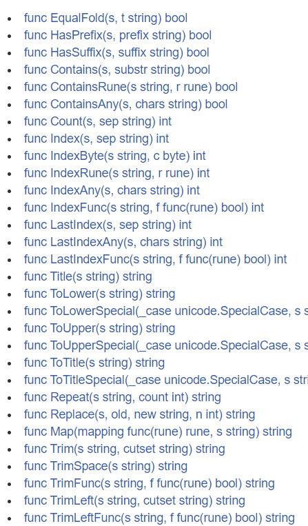
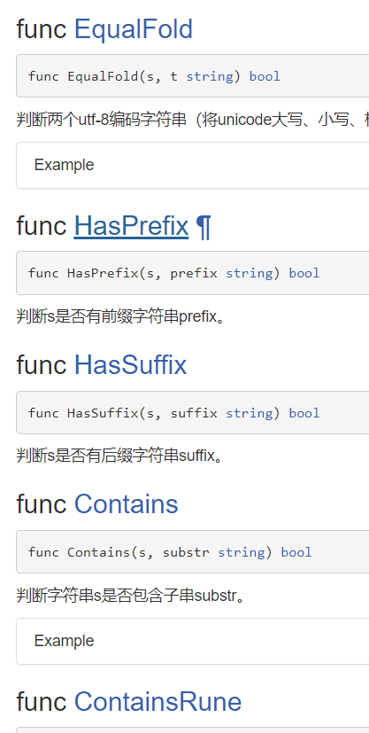

# GO 中 string 的实现原理

## 字符串是什么？

他是一种基本类型（`string 类型`），并且是一个**不可改变的UTF-8**字符序列

在众多编程语言里面，相信都少不了字符串类型


字符串，顾名思义就是一串字符，我们要明白，字符也是分为中文字符和英文字符的

例如我们在 `C/C++` 中 ， 一个英文字符占 **1** 个字节，一个中文字符有的占 **2** 个字节，有的占**3**个字节

用到 `mysql` 的中文字符，有的占 **4** 个字节

回过来看 GO 里面的字符串，字符也是根据英文和中文不一样，一个字符所占用的字节数也是不一样的，大体分为如下 **2** 种

- 英文的字符，按照ASCII 码来算，占用 **1** 个字节
- 其他的字符，包括中文字符在内的，根据不同字符，占用字节数是 **2 -- 4**个字节

## 字符串的数据结构是啥样的？

说到字符串的数据结构，我们先来看看 GO 里面的字符串，是在哪个包里面

不难发现，我们随便在 GOLANG 里面 定义个`string 变量`，就能够知道 string 类型是在哪个包里面，例如

```go
var name  string
```

GO 里面的字符串对应的包是 `builtin`

```go
// string is the set of all strings of 8-bit bytes, conventionally but not
// necessarily representing UTF-8-encoded text. A string may be empty, but
// not nil. Values of string type are immutable.
type string string
```

- 字符串这个类型，是所有`8-bits` 字符串的集合，通常但不一定表示`utf -8`编码的文本

- 字符串可以为空，但不能为 `nil` ，此处的字符串为空是 `""`
- 字符串类型的值是不可变的

另外，找到 `string` 在 GO 里面对应的源码文件中`src/runtime/string.go` ， 有这么一个结构体，只提供给包内使用，我们可以看到`string`的数据结构 `stringStruct` 是这个样子的



```go
type stringStruct struct {
    str unsafe.Pointer
    len int
}
```

整个结构体，就 **2** 个成员，**string **类型是不是很简单呢

- str

是对应到字符串的首地址

- len

**这个就是不难理解，是字符串的长度**

那么，在创建一个字符串变量的时候，`stringStruct` 是在哪里使用到的呢？

我们看看 GO **string.go** 文件中的源码

```go
//go:nosplit
func gostringnocopy(str *byte) string {
   ss := stringStruct{str: unsafe.Pointer(str), len: findnull(str)}  // 构建成 stringStruct
   s := *(*string)(unsafe.Pointer(&ss))  // 强转成 string
   return s
}
```

```go
//go:nosplit
func findnull(s *byte) int {
   if s == nil {
      return 0
   }

   // Avoid IndexByteString on Plan 9 because it uses SSE instructions
   // on x86 machines, and those are classified as floating point instructions,
   // which are illegal in a note handler.
   if GOOS == "plan9" {
      p := (*[maxAlloc/2 - 1]byte)(unsafe.Pointer(s))
      l := 0
      for p[l] != 0 {
         l++
      }
      return l
   }

   // pageSize is the unit we scan at a time looking for NULL.
   // It must be the minimum page size for any architecture Go
   // runs on. It's okay (just a minor performance loss) if the
   // actual system page size is larger than this value.
   const pageSize = 4096

   offset := 0
   ptr := unsafe.Pointer(s)
   // IndexByteString uses wide reads, so we need to be careful
   // with page boundaries. Call IndexByteString on
   // [ptr, endOfPage) interval.
   safeLen := int(pageSize - uintptr(ptr)%pageSize)

   for {
      t := *(*string)(unsafe.Pointer(&stringStruct{ptr, safeLen}))
      // Check one page at a time.
      if i := bytealg.IndexByteString(t, 0); i != -1 {
         return offset + i
      }
      // Move to next page
      ptr = unsafe.Pointer(uintptr(ptr) + uintptr(safeLen))
      offset += safeLen
      safeLen = pageSize
   }
}
```

简单分为 **2** 步：

- 先将字符数据构建程 **stringStruct**
- 再通过 **gostringnocopy** 函数 转换成 string


## 字符串中的数据为什么不能被修改呢？

从上述官方说明中，我们可以看到，字符串类型的值是不可变的

**可是这是为啥呢？**

我们以前在写`C/C++`的时候，为啥可以开辟空间存放多个字符，并且还可以修改其中的某些字符呢？

可是在 `C/C++`里面的字面量也是不可以改变的

GO 里面的 string 类型，是不是也和 字面量一样的呢？我们来看看吧


字符串类型，本身也是拥有对应的内存空间的，那么修改`string`类型的值应该是要支持的。

可是，`XDM` 在 Go 的实现中，`string` 类型是不包含内存空间，只有一个内存的指针，这里就有点想C/C++里面的案例：

```c++
char * str = "XMTONG"
```

上述的 `str`是绝对不能做修改的，`str`只是作为可读，不能写的

在GO 里面的字符串，就与上述类似

这样做的好处是 `string` 变得非常轻量，可以很方便的进行传递而不用担心内存拷贝（这也避免了内存带来的诸多问题)

GO 中的 `string`类型一般是指向字符串字面量

字符串字面量存储位置是在虚拟内存分区的**只读段**上面，而不是堆或栈上

**因此，GO 的 `string` 类型不可修改的**


可是我们想一想，要是在GO 里面字符串全都是只读的，那么我们如何动态修改一些我们需要改变的字符呢，这岂不是缺陷了

别慌

GO 里面还有byte数组，**[]byte**

**这里顺带说一下**

上述 `char * str = "XMTONG"`


- 字符串长度，就是字符的个数，为 6
- 计算`str`所占字节数（C/C++中是通过 `sizeof()` 来计算的）的话，那就是 7 ，因为尾巴后面还有一个'\0'

**计算机中有这样的对应关系，简单提一下：**

1 Bytes = 8 bit

1 K = 1024 Bytes

1 M = 1024 K

1 G = 1024 M

## 为什么有了字符串 还要 []byte？

原因正如上述我们说到的，如果全是一些只读的字面量，那么我们编码的时候就没得玩了

另外，也是根据使用字符串的场景原因，单是string无法满足所有的场景，因此得有一个我们可以修改里面值的 **[]byte** 来弥补一下

说到这里，我们应该就知道了，`string` 和`[]byte`都是可以表示字符串，没毛病 ，

不过，他们毕竟对应不同的数据结构，使用方式也有一定的区别，GO 提供的对应方法也是不尽相同

我们来看看什么场景用 **string 类型**， 啥场景 使用 **[]byte 类型**


使用到 **string 类型**的 地方：

- 需要对字符串进行比较的时候，使用**string 类型**非常方便，直接使用操作符进行比较即可
-  **string 类型** 类型，为空的时候是 **""**，他不能和`nil`做比较，因此，不用到`nil`的时候，也可以使用  **string 类型**

使用到 **[]byte 类型**的 地方：

- 需要修改字符串中字符的应用场景，使用**[]byte 类型**就相当灵活了，用起来很香
-  **[]byte 类型** 为空的话，会是返回 nil ，需要使用到 nil 的时候，就可以使用他
-  **[]byte 类型** 本身就可以按照切片的方式来玩，因此需要操作切片的时候，也可以用他

### 就上述场景来看，好像使用 **[]byte** 更加实在和灵活，为啥还要用 **string** ？

原因如下：

- **string 类型**看起来直观，用起来简单
- **[]byte**，byte 数组，我们可以知道，里面都是一个字节一个字节的，这个会比较多的用在底层，对操作字节比较关注的时候

## 字符串 和 []byte 如何互相转换？

看到这里，分别了解了 `string` 类型， 和 `[]byte` 类型的应用场景

毋庸置疑，我们编码过程中，肯定少不了对他们做相互转换，我们来看看在 GO ，里面如何使用

### 字符串转 []byte

```go
package main

import (
   "fmt"
)


func main(){
    var str string

    str = "XMTONG"

    strByte := []byte(str)
    for _,v :=range strByte{
        fmt.Printf("%x ",v)
    }
}
```

代码输出为：

```shell
58 4d 54 4f 4e 47
```



上述代码转成 `[]byte` 之后是一个字节，一个字节的

将每一个字节的值用十六进制打印出来，我们可以看到，`XMTONG` 对应 `584d544f4e47`

### []byte 转字符串

`[]byte`转字符串在GO 里面那就更简单了

```go
func main(){
   name := []byte("XMTONG")
   fmt.Println(string(name))
}
```

## GO 中 字符串都会涉及到哪些函数？

无论什么语言，对于字符串大概涉及如下几种操作，若有偏差，还请指正：

- 计算字符串长度
- 拼接
- 切割
- 找到字串进行替换，找到字符串的具体位置和出现的次数
- 统计字符串
- 字符串进制转换

具体的函数使用方法也比较简单，推荐大家感兴趣的可以直接看go 的开发文档，需要的时候去查一下即可。

GO 的标准开发文档，在搜索引擎里面还是比较容易搜索到的






## 总结

- 分享了字符串具体是啥
- GO 中字符串的特性，为什么不能被修改
- 字符串 GO 源码是如何构建的
- 字符串 和 `[]byte` 的由来和应用场景
- 字符串与 `[]byte` 相互转换
- 顺带提了GO 的标准开发文档，大家可以用起来哦

---

> 作者：小魔童哪吒
> 链接：https://learnku.com/articles/58273#f7adf0
> 来源：learnku
> 著作权归作者所有。商业转载请联系作者获得授权，非商业转载请注明出处。
