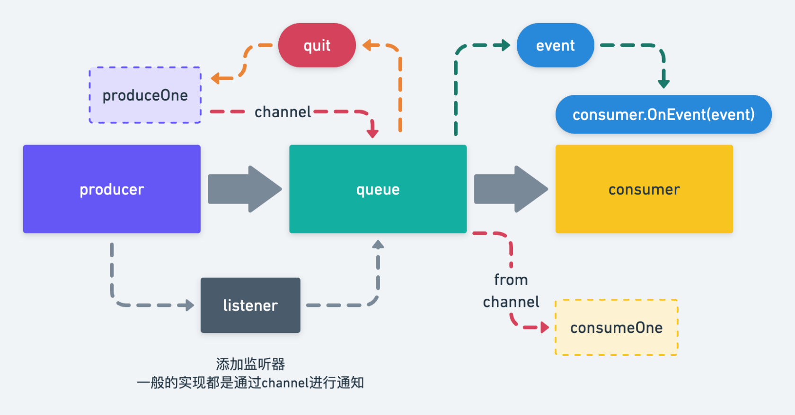

# 如何让消息队列达到最大吞吐量？

> 你在使用消息队列的时候关注过吞吐量吗？
>
> 思考过吞吐量的影响因素吗？
>
> 考虑过怎么提高吗？
>
> 总结过最佳实践吗？

本文带你一起探讨下消息队列消费端高吞吐的 `Go` 框架实现。Let’s go!

## 关于吞吐量的一些思考

* 写入消息队列吞吐量取决于以下两个方面

    * 网络带宽
    * 消息队列（比如Kafka）写入速度

  最佳吞吐量是让其中之一打满，而一般情况下内网带宽都会非常高，不太可能被打满，所以自然就是讲消息队列的写入速度打满，这就就有两个点需要平衡

    * 批量写入的消息量大小或者字节数多少
    * 延迟多久写入

  go-zero 的 `PeriodicalExecutor` 和 `ChunkExecutor` 就是为了这种情况设计的

* 从消息队列里消费消息的吞吐量取决于以下两个方面

    * 消息队列的读取速度，一般情况下消息队列本身的读取速度相比于处理消息的速度都是足够快的
    * 处理速度，这个依赖于业务

  这里有个核心问题是不能不考虑业务处理速度，而读取过多的消息到内存里，否则可能会引起两个问题：

    * 内存占用过高，甚至出现OOM，`pod` 也是有 `memory limit` 的
    * 停止 `pod` 时堆积的消息来不及处理而导致消息丢失

## 解决方案和实现


借用一下 `Rob Pike` 的一张图，这个跟队列消费异曲同工。左边4个 `gopher` 从队列里取，右边4个 `gopher` 接过去处理。比较理想的结果是左边和右边速率基本一致，没有谁浪费，没有谁等待，中间交换处也没有堆积。

我们来看看 `go-zero` 是怎么实现的：

* `Producer` 端

```go
	for {
		select {
		case <-q.quit:
			logx.Info("Quitting producer")
			return
		default:
			if v, ok := q.produceOne(producer); ok {
				q.channel <- v
			}
		}
	}
```

没有退出事件就会通过 `produceOne` 去读取一个消息，成功后写入 `channel`。利用 `chan` 就可以很好的解决读取和消费的衔接问题。

* `Consumer` 端

```go
	for {
		select {
		case message, ok := <-q.channel:
			if ok {
				q.consumeOne(consumer, message)
			} else {
				logx.Info("Task channel was closed, quitting consumer...")
				return
			}
		case event := <-eventChan:
			consumer.OnEvent(event)
		}
	}
```

这里如果拿到消息就去处理，当 `ok` 为 `false` 的时候表示 `channel` 已被关闭，可以退出整个处理循环了。同时我们还在 `redis queue` 上支持了 `pause/resume`，我们原来在社交场景里大量使用这样的队列，可以通知 `consumer` 暂停和继续。

* 启动 `queue`，有了这些我们就可以通过控制 `producer/consumer` 的数量来达到吞吐量的调优了

```go
func (q *Queue) Start() {
	q.startProducers(q.producerCount)
	q.startConsumers(q.consumerCount)

	q.producerRoutineGroup.Wait()
	close(q.channel)
	q.consumerRoutineGroup.Wait()
}
```

这里需要注意的是，先要停掉 `producer`，再去等 `consumer` 处理完。

到这里核心控制代码基本就讲完了，其实看起来还是挺简单的，也可以到 [https://github.com/tal-tech/go-zero/tree/master/core/queue](https://github.com/tal-tech/go-zero/tree/master/core/queue) 去看完整实现。

## 使用

基本的使用流程：

1. 创建 `producer` 或  `consumer`
2. 启动 `queue`
3. 生产消息 / 消费消息

对应到 `queue` 中，大致如下：

### 创建 queue

```go
// 生产者创建工厂
producer := newMockedProducer()
// 消费者创建工厂
consumer := newMockedConsumer()
// 将生产者以及消费者的创建工厂函数传递给 NewQueue()
q := queue.NewQueue(func() (Producer, error) {
  return producer, nil
}, func() (Consumer, error) {
  return consumer, nil
})
```

我们看看 `NewQueue` 需要什么参数：

1. `producer` 工厂方法
2. `consumer` 工厂方法

将 `producer & consumer` 的工厂函数传递  `queue` ，由它去负责创建。框架提供了 `Producer` 和 `Consumer` 的接口以及工厂方法定义，然后整个流程的控制 `queue` 实现会自动完成。

### 生产 `message`

我们通过自定义一个 `mockedProducer` 来模拟：

```go
type mockedProducer struct {
	total int32
	count int32
  // 使用waitgroup来模拟任务的完成
	wait  sync.WaitGroup
}
// 实现 Producer interface 的方法：Produce()
func (p *mockedProducer) Produce() (string, bool) {
	if atomic.AddInt32(&p.count, 1) <= p.total {
		p.wait.Done()
		return "item", true
	}
	time.Sleep(time.Second)
	return "", false
}
```

`queue` 中的生产者编写都必须实现：

- `Produce()`：由开发者编写生产消息的逻辑
- `AddListener()`：添加事件 `listener`

### 消费 `message`

我们通过自定义一个 `mockedConsumer` 来模拟：

```go
type mockedConsumer struct {
	count  int32
}

func (c *mockedConsumer) Consume(string) error {
	atomic.AddInt32(&c.count, 1)
	return nil
}
```

### 启动  `queue`

启动，然后验证我们上述的生产者和消费者之间的数据是否传输成功：

```go
func main() {
	// 创建 queue
	q := NewQueue(func() (Producer, error) {
		return newMockedProducer(), nil
	}, func() (Consumer, error) {
		return newMockedConsumer(), nil
	})
  // 启动panic了也可以确保stop被执行以清理资源
  defer q.Stop()
	// 启动
	q.Start()
}
```

以上就是 `queue` 最简易的实现示例。我们通过这个 `core/queue` 框架实现了基于 `redis` 和 `kafka` 等的消息队列服务，在不同业务场景中经过了充分的实践检验。你也可以根据自己的业务实际情况，实现自己的消息队列服务。

## 整体设计



整体流程如上图：

1. 全体的通信都由 `channel` 进行
2. `Producer` 和 `Consumer` 的数量可以设定以匹配不同业务需求
3. `Produce` 和 `Consume` 具体实现由开发者定义，`queue` 负责整体流程

## 总结

本篇文章讲解了如何通过 `channel` 来平衡从队列中读取和处理消息的速度，以及如何实现一个通用的消息队列处理框架，并通过 `mock` 示例简单展示了如何基于 `core/queue` 实现一个消息队列处理服务。你可以通过类似的方式实现一个基于 `rocketmq` 等的消息队列处理服务。

> 作者：kevwan
> 链接：https://learnku.com/articles/57171
> 来源：learnku
> 著作权归作者所有。商业转载请联系作者获得授权，非商业转载请注明出处。