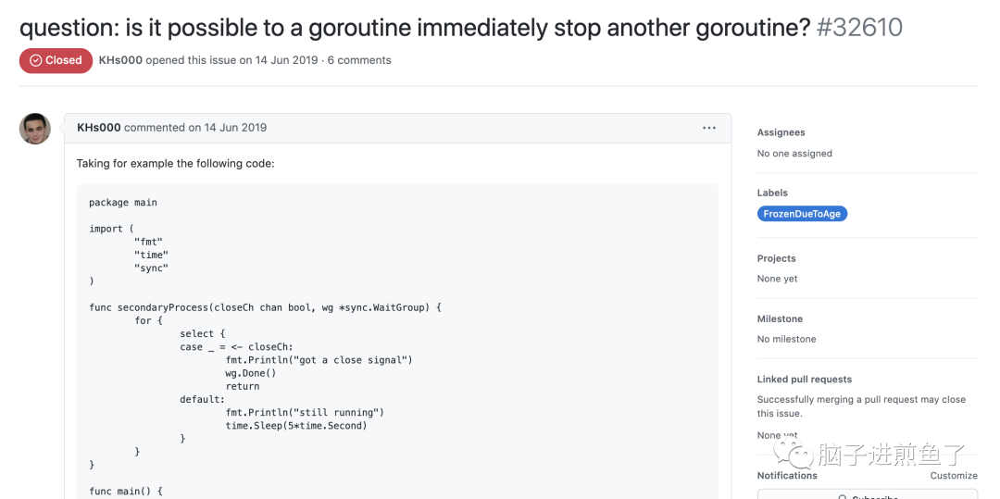

## 回答我，停止 Goroutine 有几种方法？

协程（goroutine）作为 Go 语言的扛把子，经常在各种 Go 工程项目中频繁露面，甚至有人会为了用 goroutine 而强行用他。
在 Go 工程师的面试中，也绕不开他，会有人问 `如何停止一个 goroutine？`，一下子就把话题范围扩大了，这是一个涉及多个知识点的话题，能进一步深入问。
为此，今天煎鱼就带大家了解一下停止 goroutine 的方法！

### goroutine 案例

在日常的工作中，我们常会有这样的 Go 代码，go 关键字一把搜起一个 goroutine：

```go
func main() {
	ch := make(chan string, 6)
	go func() {
		for {
			ch <- "脑子进煎鱼了"
		}
	}()
}
```

初入 goroutine 大门的开发者可能就完事了，但跑一段时间后，他就可能会遇到一些问题，苦苦排查...
像是：当 goroutine 内的任务，运行的太久，又或是卡死了...就会一直阻塞在系统中，变成 goroutine 泄露，或是间接造成资源暴涨，会带来许多的问题。
如何在停止 goroutine，就成了一门必修技能了，不懂就没法用好 goroutine。

### 关闭 channel

第一种方法，就是借助 channel 的 close 机制来完成对 goroutine 的精确控制。
代码如下：

```go
func main() {
	ch := make(chan string, 6)
	go func() {
		for {
			v, ok := <-ch
			if !ok {
				fmt.Println("结束")
				return
			}
			fmt.Println(v)
		}
	}()

	ch <- "煎鱼还没进锅里..."
	ch <- "煎鱼进脑子里了！"
	close(ch)
	time.Sleep(time.Second)
}
```

在 Go 语言的 channel 中，channel 接受数据有两种方法：

```go
msg := <-ch
msg, ok := <-ch
```

这两种方式对应着不同的 runtime 方法，我们可以利用其第二个参数进行判别，当关闭 channel 时，就根据其返回结果跳出。
另外我们也可以利用 for range 的特性：

```go
go func() {
	for {
		for v := range ch {
			fmt.Println(v)
		}
	}
}() 
```

其会一直循环遍历通道 ch，直到其关闭为止，是颇为常见的一种用法。

### 定期轮询 channel

第二种方法，是更为精细的方法，其结合了第一种方法和类似信号量的处理方式。
代码如下：

```go
func main() {
	ch := make(chan string, 6)
	done := make(chan struct{})
	go func() {
		for {
			select {
			case ch <- "脑子进煎鱼了":
			case <-done:
				close(ch)
				return
			}
			time.Sleep(100 * time.Millisecond)
		}
	}()

	go func() {
		time.Sleep(3 * time.Second)
		done <- struct{}{}
	}()

	for i := range ch {
		fmt.Println("接收到的值: ", i)
	}

	fmt.Println("结束")
}
```

在上述代码中，我们声明了变量 done，其类型为 channel，用于作为信号量处理 goroutine 的关闭。
而 goroutine 的关闭是不知道什么时候发生的，因此在 Go 语言中会利用 for-loop 结合 select 关键字进行监听，再进行完毕相关的业务处理后，再调用 close 方法正式关闭 channel。
若程序逻辑比较简单结构化，也可以不调用 close 方法，因为 goroutine 会自然结束，也就不需要手动关闭了。

### 使用 context

第三种方法，可以借助 Go 语言的上下文（context）来做 goroutine 的控制和关闭。
代码如下：

```go
func main() {
	ch := make(chan struct{})
	ctx, cancel := context.WithCancel(context.Background())

	go func(ctx context.Context) {
		for {
			select {
			case <-ctx.Done():
				ch <- struct{}{}
				return
			default:
				fmt.Println("煎鱼还没到锅里...")
			}

			time.Sleep(500 * time.Millisecond)
		}
	}(ctx)

	go func() {
		time.Sleep(3 * time.Second)
		cancel()
	}()

	<-ch
	fmt.Println("结束")
}
```

在 context 中，我们可以借助 ctx.Done 获取一个只读的 channel，类型为结构体。可用于识别当前 channel 是否已经被关闭，其原因可能是到期，也可能是被取消了。
因此 context 对于跨 goroutine 控制有自己的灵活之处，可以调用 context.WithTimeout 来根据时间控制，也可以自己主动地调用 cancel 方法来手动关闭。

### 干掉另外一个 goroutine

在了解了停止 goroutine 的 3 种经典方法后，又有小伙伴提出了新的想法。就是 “我想在 goroutineA 里去停止 goroutineB，有办法吗？”

答案是不能，因为在 Go 语言中，goroutine 只能自己主动退出，一般通过 channel 来控制，不能被外界的其他 goroutine 关闭或干掉，也没有 goroutine 句柄的显式概念。



在 Go issues 中也有人提过类似问题，Dave Cheney 给出了一些思考：

- 如果一个 goroutine 被强行停止了，它所拥有的资源会发生什么？堆栈被解开了吗？defer 是否被执行？
  
- 如果执行 defer，该 goroutine 可能可以继续无限期地生存下去。
  
- 如果不执行 defer，该 goroutine 原本的应用程序系统设计逻辑将会被破坏，这肯定不合理。

- 如果允许强制停止 goroutine，是要释放所有东西，还是直接把它从调度器中踢出去，你想通过此解决什么问题？

这都是值得深思的，另外一旦放开这种限制。作为程序员，你维护代码。很有可能就不知道 goroutine 的句柄被传到了哪里，又是在何时何地被人莫名其妙关闭，非常糟糕...
总结

在今天这篇文章中，我们介绍了在 Go 语言中停止 goroutine 的三大经典方法（channel、context，channel+context）和其背后的使用原理。

同时针对 goroutine 不可以跨 goroutine 强制停止的原因进行了分析。其实 goroutine 的设计就是这样的，包括像 goroutine+panic+recover 的设计也是遵循这个原理，因此也有的 Go 开发者总是会误以为跨 goroutine 能有 recover 接住...

记住，在 Go 语言中每一个 goroutine 都需要自己承担自己的任何责任，这是基本原则。

> 作者：脑子进煎鱼了
> 链接：https://mp.weixin.qq.com/s/tN8Q1GRmphZyAuaHrkYFEg
> 来源：微信公众号
> 著作权归作者所有。商业转载请联系作者获得授权，非商业转载请注明出处。